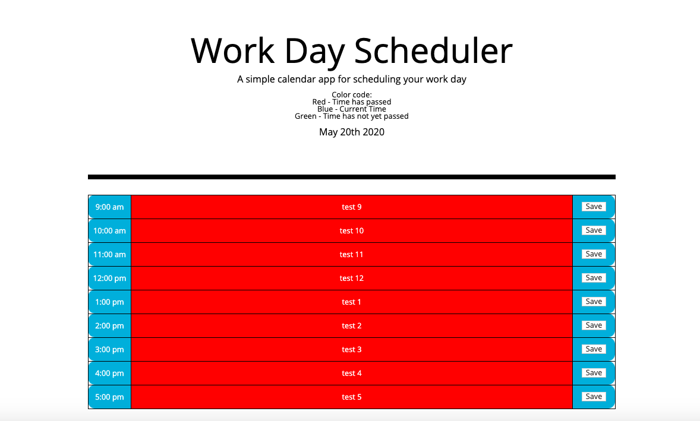

Work Day Planner

Description:
-  This app is designed to help the user plan their work day hour by hour by allowing them to enter a task for each hour. Each task block will then change color based on it's relation to the current time as a means to help the user manage their time. 

Usage:
   -  The app presents the user with the current date at the top of the page as well as a table explaining the color code for the task blocks. The user then has the ability to click on the task block and enter a task. When the user clicks the save button the tasks are then stored in local storage and will be loaded the next time the webpage is opened.

